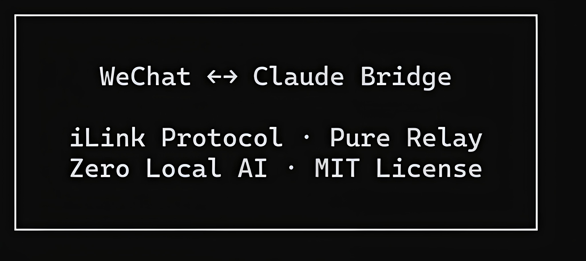
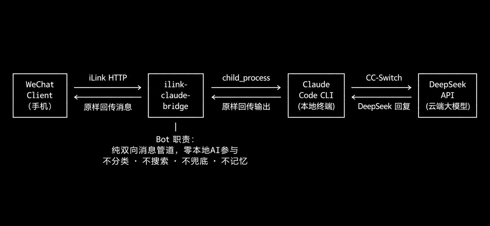

# CC-Bridge: WeChat ↔ Claude 纯消息中转桥接系统
---

## 1. 项目概述
CC-Bridge 是一款面向终端自动化操控的极简微信消息纯中转系统，核心架构基于 iLink 双向通信协议，实现微信客户端与本地终端 Claude 程序的无损耗消息互通。系统全程零本地 AI 推理参与，仅作为纯消息管道，将微信端指令完整同步至本地终端，通过 CCSwitch 协议层对接 DeepSeek 云端大模型完成任务执行，再将终端运行日志、任务结果、状态反馈原路回传至微信，实现移动端对本地终端的无感化远程操控。

本系统屏蔽了传统微信 Bot 的闲聊、记忆、兜底等冗余功能，专注于指令的双向无损传输，为远程终端操控、自动化任务执行提供了轻量、稳定、低侵入性的解决方案。

---

## 2. 项目封面与品牌标识

### 2.1 设计说明
本封面为项目官方品牌标识，采用终端极简设计语言，核心信息包含：
1.  **项目名称**：`WeChat ↔ Claude Bridge`，明确系统核心定位为微信与 Claude 程序的双向桥接工具
2.  **核心技术标识**：`iLink Protocol · Pure Relay`，标注系统自研通信协议与纯中转核心特性
3.  **技术约束声明**：`Zero Local AI · MIT License`，明确系统零本地 AI 参与的设计原则与开源合规属性

### 2.2 设计价值
封面采用纯黑背景+白色终端字体的设计，还原系统终端运行的原生科技感，同时以极简排版传递项目「纯粹、无冗余、高专注」的设计理念，适配 GitHub 项目主页的品牌展示与传播需求。

---

## 3. 系统核心架构设计

### 3.1 架构链路说明
本图为系统全链路通信架构，采用四层解耦设计，实现端到端的消息闭环：
